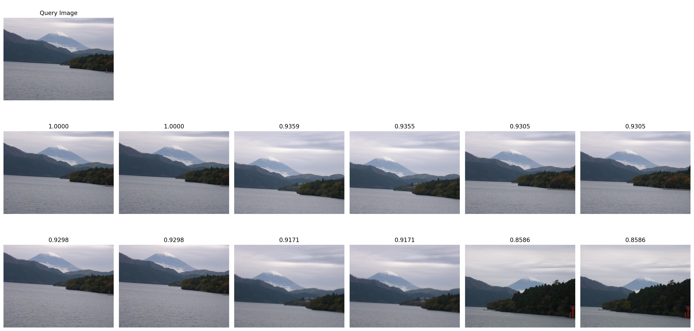

# image-retrieval

This repository presents an image retrieval pipeline that consists of a vector database storing image features extracted using a pre-trained ResNet/ViT model. Image retrieval pipeline consists of (1) a vector database building script that extracts image features of all images in the collection using a pre-trained ResNet/ViT model and stores them in a vector database by cosine similarity, (2) a search query script that extracts the features for a randomly selected image and returns the most similar images from the vector database.

The construction of the proposed image retrieval pipeline can be divided into three stages:

1 - Place your images (a collection of images that you want to create an image retrieval pipeline on) under the data folders as ```data/images```. In this project, [Landscape Pictures Dataset](https://www.kaggle.com/datasets/arnaud58/landscape-pictures) is used but feel free to use your of own image collection.   
2 - Extract the features of all images using a pre-trained ResNet model and save all features into a vector database.  
3 - For a given query image, perform a similarity search by first extracting the features of the query image and then performing a search over the vector database.  

## Installation
1. Clone the repository to your local first as follows    
```    
$ git clone https://github.com/cetinsamet/image-retrieval.git
```

2. Then recreate the virtual environment on your local using the provided ```.yml``` file and activate the venv as follows    
```
$ cd image-retrieval  
$ conda env create -f environment.yml
$ conda activate image-retrieval
```

3. Add the path of your own working directory as WORK_DIR in the configuration file ```src/config/settings.py```as follows
```
$ cd src
$ nano config/settings.py  # or use your favorite text editor and add the path of your own working directory

WORK_DIR = "PATH-TO-YOUR-OWN-WORKING-DIRECTORY"
```

4. Create a ```data``` folder as follows
```
mkdir ../data
```

5. Download data from [here](https://www.kaggle.com/datasets/arnaud58/landscape-pictures) (Landscape Pictures Dataset) and place all image files under ```data/images``` folder.

## Run
Please perform following steps sequentially to reproduce the image retrieval pipeline that gives the search query examples below.

### Building vector database
Running ```build_vector_database.py``` extracts the features of all downloaded images by using the selected pre-trained ResNet model (please use ```--feat_extractor``` flag to customize) and save the features into a vector database that is stored under ```data/``` directory.

```    
$ python3 build_vector_database.py --feat_extractor vit_l_32
```

### Search query
Finally, running ```search_query.py``` selects random object images (the amount of the selected images can be customized using ```--n``` flag) and search the most similar object images (the amount of the similar images can be customized using ```--k``` flag) by querying the pre-built vector database. 
```    
$ python3 search_query.py --feat_extractor vit_l_32 --n 10 --k 12
```

Some examples of the resulting search queries are as follows;


---

---


